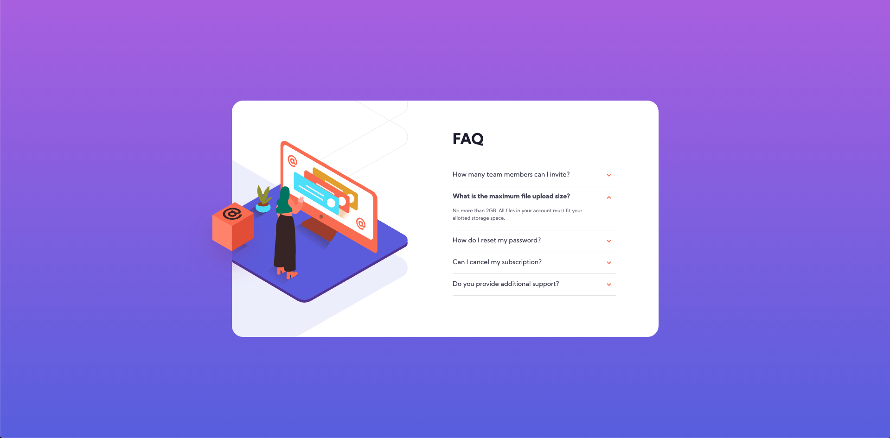

# Frontend Mentor - FAQ accordion card solution

This is a solution to the [FAQ accordion card challenge on Frontend Mentor](https://www.frontendmentor.io/challenges/faq-accordion-card-XlyjD0Oam). Frontend Mentor challenges help you improve your coding skills by building realistic projects.

## Table of contents

- [Overview](#overview)
  - [The challenge](#the-challenge)
  - [Screenshot](#screenshot)
  - [Links](#links)
- [My process](#my-process)
  - [Built with](#built-with)
  - [What I learned](#what-i-learned)
  - [Useful resources](#useful-resources)
- [Author](#author)

**Note: Delete this note and update the table of contents based on what sections you keep.**

## Overview

### The challenge

Users should be able to:

- View the optimal layout for the component depending on their device's screen size
- See hover states for all interactive elements on the page
- Hide/Show the answer to a question when the question is clicked

### Screenshot

### Links

- Solution URL: [https://github.com/rickMcGavin/fe-mentor-faq-accordion](https://github.com/rickMcGavin/fe-mentor-faq-accordion)
- Live Site URL: [Add live site URL here](https://your-live-site-url.com)

## My process

### Built with

- CSS custom properties
- Flexbox
- [React](https://reactjs.org/) - JS library
- [Next.js](https://nextjs.org/) - React framework

### What I learned

A lot about heights, particularly using them to achieve the design responsively. I did not realize you couldn't just set a height to 100% on a media query if none of the parents have a set height.

### Useful resources

In the future, I'll probably have to pay more attention to the resources I use along the way.

## Author

- Website - [rickmcgavin.github.io](https://rickmcgavin.github.io)
- Frontend Mentor - [@rickMcGavin](https://www.frontendmentor.io/profile/rickMcGavin)
- Twitter - [@rickMcGavin](https://www.twitter.com/rickMcGavin)
